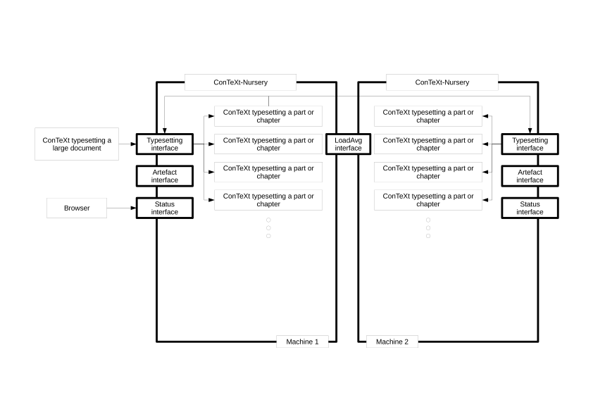

# Architecture

## Problem

The exposition of both [diSimplex](https://github.com/diSimplex) and 
[JoyLoL](https://github.com/diSimplex/JoyLoL) are an intimate mixture of 
Mathematical and Computational argumentation. As such we "develop" them as 
[ConTeXt](https://www.contextgarden.net) documents with embedded JoyLoL 
code.

These diSimplex and JoyLoL releated documents are each going to grow large, 
complex and highly inter-releated. To manage this complexity we need a tool 
which can build the documents and code in a more incremental fashion.

To do *this* we want to develop a parallelized ConTeXt typeset system.

There are two approaches to distributing parallel "build", "compile", and 
"typeset" management:

1. **On demand, driven by the "compiler" or "typesetter"**

    - This requires no up-front thought from the user and hence allows the 
      user to "explore" the problem domain as they develop their ideas.

    - There are two approaches to how to combine the resulting individual 
      parts:

      1. **Directly wait** for the (sub)result(s) before compiling or 
         typesetting further. This enables fine-grained interaction with 
         other (external) expert processes (such as a [JoyLoL Compute 
         Farm](https://github.com/diSimplex/JoyLoLComputeFarm)).

         *This can NOT be done by a more traditional rule driven build 
         system since what needs to get done develops as the user writes 
         the text*.

      2. **Combine later** by assuming some other process will accumulate 
         the results into a coherent whole.

         *This could be done by a more traditional rule driven build 
         system*.

2. **Rule driven by what end result we want**

    - This requires a detailed "up-front" dependency analysis done either 
      by the user or (semi)automatically by the build system (or both).

    - There are many build systems, such as make, bazel, etc, which could 
      be used to implement this rule driven approach.

### ConTeXt

ConTeXt, being based upon 
[TeX](http://www.tug.org/)/[LuaTeX](http://luatex.org/), is *single 
threaded*. Our goal is to be able to mimic the 
[LaTeX](https://www.latex-project.org/) [packages](https://www.ctan.org/) 
[subdocs](https://ctan.org/pkg/subdocs) 
([github](https://github.com/jbezos/subdocs)), 
[subfiles](https://ctan.org/pkg/subfiles) 
([github](https://github.com/gsalzer/subfiles)), and/or 
[standalone](https://www.ctan.org/pkg/standalone) 
([bitbucket](https://bitbucket.org/martin_scharrer/standalone/src/default/)) 
in ConTeXt (see also [LaTeX/Modular 
Documents](https://en.wikibooks.org/wiki/LaTeX/Modular_Documents)).

There are a number of potential issues:

1. Management of the a sub-document's preamble. Depending upon the 
   complexity of the over all document, this "preamble" might be scattered 
   across a number of files.

   This is what subfiles and standalone attempt to solve.

2. Sharing of the `aux` (TeX) or `tuc` (LuaTeX/ConTeXt) information which 
   includes internal cross references *between* parallelized sub-documents. 

   This is what subdocs attempts to solve.

3. Recombination of the typeset result of ConTeXt run on each of the 
   parallelized sub-documents separately.

   Both [`pdftk`](https://www.pdflabs.com/tools/pdftk-the-pdf-toolkit/) 
   (via [`iText`](https://itextpdf.com/en) 
   ([github](https://github.com/itext))) and `gs` 
   ([ghostscript](https://www.ghostscript.com/)) are able to do this in at 
   least draft form.

4. Recompute the page numbers of each parallelized (sub)document.

   This is part of the problem subdocs attempts to solve via managment of 
   the `aux` or `tuc` files.

### Distribution

It would be useful if the typesetting, compilation, and/or computation 
tasks could be distributed across as many CPUs and hence computers as 
possible. This suggests the use of a federated collection of "task 
managers" with associated pools of "workers".

As a potential issue, we need to be able to manage and view any distributed 
logs in order to allow the user to understand any typesetting, compilation, 
or computation failures.

The system will act as a highly distributed "build system" and so it needs 
to store somewhere information about all of the primary, intermediate and 
final artifacts so that the system as a whole can determine which artifacts 
need to be rebuilt, how and when.  This might represent a resource manager 
(who "stores" the artifacts), or simply a change manager (who "stores" 
sufficient information about each artifact so that the system can determine 
if something has changed). This manager will also need to understand the 
evolving build dependencies.

## Solution

Inspired by [OverLeaf's CLSI](https://github.com/overleaf/clsi) service, we 
will implement the following (high-level) system:

### Principles

1. Keep the clients and workers simple. They are already complex enough 
   with their own tasks (for example ConTeXt and GCC/JoyLoL).

2. Use as much asynchrony as possible. 

   GoLang provides a very disciplined approach to multi-processing and 
   asynchrony.

   Lua (as embedded in LuaTeX) has an associated binding of the libuv 
   asynchrony library. ([luvit/luv](https://github.com/luvit/luv))

3. Keep the "wire protocols" simple. Reuse existing libraries of each tool.

   Again, as inspired by OverLeaf's CLSI, we will use a RESTful/JSON based 
   Protocol. This allows us to use existing Network Libraries in both Lua. 
   LuaTeX, and GoLang.

4. Place the "build" smarts into a (configurable) "task-manager".

   It will be critical that this task-manager is able to capture the 
   evolving dependencies *as the typesetting takes place*.

   The evolving build dependencies should be browsable as a web-site.

5. Provide a (caching) workspace-manager to manage intermediate artifacts 
   and allow the task-manager to determine if any thing has changed.

   This workspace-manager should be both federated and able to be browsed 
   as a web-site in addition to any RESTful API it might have.

   The workspace-manager should provide a read-only on-disk structure to 
   allow a knowledgable user to view and or copy the intermediate 
   artifacts.

6. Provide a federated "log" manager browsable as a web-site.

7. The combined task-manager / workspace-manager should be implemented in 
    goLang (to provide robust multi-threading). The task-manager might have 
    an embedded Lua engine to provide scriptability. It will probalby keep 
    its meta-data in an SQLite3 database.

## Resources

See [Resources](docs/Resources.md)

